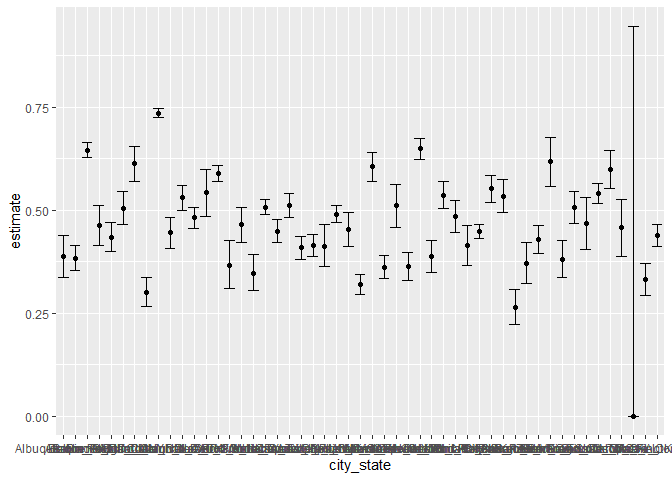
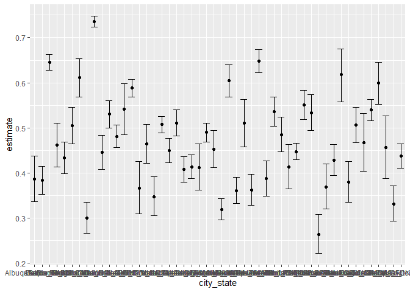

p8105_hw5_zx2425
================

# Problem2

## step1

Describe the raw data. Create a city_state variable (e.g. “Baltimore,
MD”)

``` r
hmcd =read.csv("./homicide-data.csv") %>% 
  janitor::clean_names() 
head(hmcd)
```

    ##          uid reported_date victim_last victim_first victim_race victim_age
    ## 1 Alb-000001      20100504      GARCIA         JUAN    Hispanic         78
    ## 2 Alb-000002      20100216     MONTOYA      CAMERON    Hispanic         17
    ## 3 Alb-000003      20100601 SATTERFIELD      VIVIANA       White         15
    ## 4 Alb-000004      20100101    MENDIOLA       CARLOS    Hispanic         32
    ## 5 Alb-000005      20100102        MULA       VIVIAN       White         72
    ## 6 Alb-000006      20100126        BOOK    GERALDINE       White         91
    ##   victim_sex        city state      lat       lon           disposition
    ## 1       Male Albuquerque    NM 35.09579 -106.5386 Closed without arrest
    ## 2       Male Albuquerque    NM 35.05681 -106.7153      Closed by arrest
    ## 3     Female Albuquerque    NM 35.08609 -106.6956 Closed without arrest
    ## 4       Male Albuquerque    NM 35.07849 -106.5561      Closed by arrest
    ## 5     Female Albuquerque    NM 35.13036 -106.5810 Closed without arrest
    ## 6     Female Albuquerque    NM 35.15111 -106.5378        Open/No arrest

The data set has 52179 \* `r ncol(hmcd)` dimensions. Where uid describes
the incident number, reported_date indicates the date and time,
victim_last and victim first indicates the victim’s name, and other data
includes: race, age, gender, city, state, longitude, and latitude. And
whether the incident was finally detected.

## step2

then summarize within cities to obtain the total number of homicides and
the number of unsolved homicides (those for which the disposition is
“Closed without arrest” or “Open/No arrest”).

``` r
hmcd=hmcd %>% 
  mutate(
    city_state=str_c(city,"_",state)
  )

count_vic=hmcd %>% 
  group_by(city_state) %>% 
  summarize(
    vic_number=n()
  )
count_dect=hmcd %>% 
  filter(disposition %in% c("Closed without arrest", "Open/No arrest")) %>% 
  group_by(city_state) %>% 
  summarize(
    undec_number=n()
  )

count = full_join(count_vic,count_dect,by="city_state")
count[is.na(count)] = 0
```

## step3

For the city of **Baltimore, MD**, use the **prop.test** function to
estimate the proportion of homicides that are unsolved; save the output
of prop.test as an R object, apply the **broom::tidy** to this object
and pull the *estimated* *proportion* and *confidence intervals* from
the resulting tidy dataframe.

``` r
city_B= hmcd %>% 
  filter(city_state == 'Baltimore_MD')
city_B_count= city_B %>% 
   summarise(
      unsolved = sum(disposition %in%c("Closed without arrest", "Open/No arrest")  ),
      ###sum can calculate the True or false with result of number
      n = n()
    )
city_B_test = 
  prop.test(x = city_B_count %>% pull(unsolved),n = city_B_count %>% pull(n))
city_B_test %>% 
  broom::tidy() %>% 
  knitr::kable()  
```

|  estimate | statistic | p.value | parameter |  conf.low | conf.high | method                                               | alternative |
|----------:|----------:|--------:|----------:|----------:|----------:|:-----------------------------------------------------|:------------|
| 0.6455607 |   239.011 |       0 |         1 | 0.6275625 | 0.6631599 | 1-sample proportions test with continuity correction | two.sided   |

## step4

Now run **prop.test** for *each of the cities* in your dataset, and
extract both the proportion of unsolved homicides and the confidence
interval for each. Do this within a “tidy” pipeline, making use of
**purrr::map, purrr::map2**, list columns and **unnest** as necessary to
create a tidy dataframe with *estimated proportions and CIs* for each
city.

``` r
pro_test_df= function(each_city){
  city_info=
    each_city %>% 
    summarize(
      unsolved = sum(disposition %in%c("Closed without arrest", "Open/No arrest")  ),
      n=n()
    )
  city_test= prop.test(
    x=city_info %>% pull(unsolved),
    n=city_info %>% pull(n)
  )
  city_test
}
```

``` r
hmcd %>% 
  filter(city_state == 'Albuquerque_NM') %>% 
  pro_test_df() %>% 
  broom::tidy() %>% 
  knitr::kable()
```

|  estimate | statistic |  p.value | parameter |  conf.low | conf.high | method                                               | alternative |
|----------:|----------:|---------:|----------:|----------:|----------:|:-----------------------------------------------------|:------------|
| 0.3862434 |  19.11376 | 1.23e-05 |         1 | 0.3372604 | 0.4375766 | 1-sample proportions test with continuity correction | two.sided   |

``` r
city_iterate = 
  hmcd %>% 
    nest(-city_state) %>% 
    mutate(
      test_results = map(data, pro_test_df),
      ##???
      tidy_results = map(test_results, broom::tidy)
    ) %>% 
    select(city_state, tidy_results) %>% 
    unnest(tidy_results) %>%
    ##~~~
    select(city_state, estimate, starts_with('conf'))
```

    ## Warning: All elements of `...` must be named.
    ## Did you want `data = -city_state`?

    ## Warning in prop.test(x = city_info %>% pull(unsolved), n = city_info %>% : Chi-
    ## squared近似算法有可能不准

``` r
    ##!!!
city_iterate
```

    ## # A tibble: 51 × 4
    ##    city_state     estimate conf.low conf.high
    ##    <chr>             <dbl>    <dbl>     <dbl>
    ##  1 Albuquerque_NM    0.386    0.337     0.438
    ##  2 Atlanta_GA        0.383    0.353     0.415
    ##  3 Baltimore_MD      0.646    0.628     0.663
    ##  4 Baton Rouge_LA    0.462    0.414     0.511
    ##  5 Birmingham_AL     0.434    0.399     0.469
    ##  6 Boston_MA         0.505    0.465     0.545
    ##  7 Buffalo_NY        0.612    0.569     0.654
    ##  8 Charlotte_NC      0.300    0.266     0.336
    ##  9 Chicago_IL        0.736    0.724     0.747
    ## 10 Cincinnati_OH     0.445    0.408     0.483
    ## # … with 41 more rows

## step5

Create a plot that shows the estimates and CIs for each city – check out
geom_errorbar for a way to add error bars based on the upper and lower
limits. Organize cities according to the proportion of unsolved
homicides.

``` r
city_iterate %>% 
  ggplot(aes(x = city_state, y = estimate)) +
  geom_point() +
  geom_errorbar(aes(ymin = conf.low, ymax = conf.high))
```

<!-- --> By
observing the plote, we can see there is a extreme data which is
Tulsa_AL, we delete it can replot again.

``` r
city_iterate = city_iterate %>% 
  filter(city_state !="Tulsa_AL")
city_iterate %>% 
  ggplot(aes(x = city_state, y = estimate)) +
  geom_point() +
  geom_errorbar(aes(ymin = conf.low, ymax = conf.high))
```

<!-- -->
