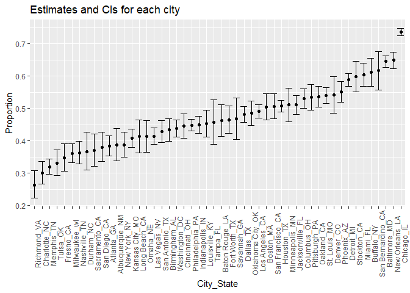
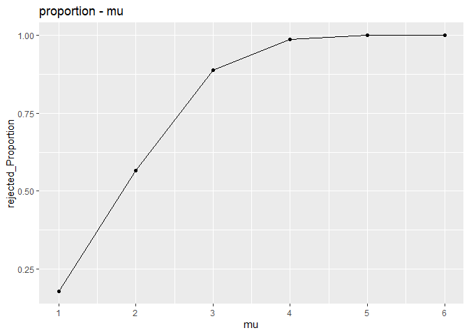

p8105_hw5_zx2425
================

## Problem 1

## step1

The code chunk below imports the data in individual spreadsheets
contained in `./data/zip_data/`. To do this, I create a dataframe that
includes the list of all files in that directory and the complete path
to each file. As a next step, I `map` over paths and import data using
the `read_csv` function. Finally, I `unnest` the result of `map`.

``` r
full_df = 
  tibble(
    files = list.files("data/zip_data/"),
    path = str_c("data/zip_data/", files)
  ) %>% 
  mutate(data = map(path, read_csv)) %>% 
  unnest()
```

    ## Rows: 1 Columns: 8
    ## ── Column specification ────────────────────────────────────────────────────────
    ## Delimiter: ","
    ## dbl (8): week_1, week_2, week_3, week_4, week_5, week_6, week_7, week_8
    ## 
    ## ℹ Use `spec()` to retrieve the full column specification for this data.
    ## ℹ Specify the column types or set `show_col_types = FALSE` to quiet this message.
    ## Rows: 1 Columns: 8
    ## ── Column specification ────────────────────────────────────────────────────────
    ## Delimiter: ","
    ## dbl (8): week_1, week_2, week_3, week_4, week_5, week_6, week_7, week_8
    ## 
    ## ℹ Use `spec()` to retrieve the full column specification for this data.
    ## ℹ Specify the column types or set `show_col_types = FALSE` to quiet this message.
    ## Rows: 1 Columns: 8
    ## ── Column specification ────────────────────────────────────────────────────────
    ## Delimiter: ","
    ## dbl (8): week_1, week_2, week_3, week_4, week_5, week_6, week_7, week_8
    ## 
    ## ℹ Use `spec()` to retrieve the full column specification for this data.
    ## ℹ Specify the column types or set `show_col_types = FALSE` to quiet this message.
    ## Rows: 1 Columns: 8
    ## ── Column specification ────────────────────────────────────────────────────────
    ## Delimiter: ","
    ## dbl (8): week_1, week_2, week_3, week_4, week_5, week_6, week_7, week_8
    ## 
    ## ℹ Use `spec()` to retrieve the full column specification for this data.
    ## ℹ Specify the column types or set `show_col_types = FALSE` to quiet this message.
    ## Rows: 1 Columns: 8
    ## ── Column specification ────────────────────────────────────────────────────────
    ## Delimiter: ","
    ## dbl (8): week_1, week_2, week_3, week_4, week_5, week_6, week_7, week_8
    ## 
    ## ℹ Use `spec()` to retrieve the full column specification for this data.
    ## ℹ Specify the column types or set `show_col_types = FALSE` to quiet this message.
    ## Rows: 1 Columns: 8
    ## ── Column specification ────────────────────────────────────────────────────────
    ## Delimiter: ","
    ## dbl (8): week_1, week_2, week_3, week_4, week_5, week_6, week_7, week_8
    ## 
    ## ℹ Use `spec()` to retrieve the full column specification for this data.
    ## ℹ Specify the column types or set `show_col_types = FALSE` to quiet this message.
    ## Rows: 1 Columns: 8
    ## ── Column specification ────────────────────────────────────────────────────────
    ## Delimiter: ","
    ## dbl (8): week_1, week_2, week_3, week_4, week_5, week_6, week_7, week_8
    ## 
    ## ℹ Use `spec()` to retrieve the full column specification for this data.
    ## ℹ Specify the column types or set `show_col_types = FALSE` to quiet this message.
    ## Rows: 1 Columns: 8
    ## ── Column specification ────────────────────────────────────────────────────────
    ## Delimiter: ","
    ## dbl (8): week_1, week_2, week_3, week_4, week_5, week_6, week_7, week_8
    ## 
    ## ℹ Use `spec()` to retrieve the full column specification for this data.
    ## ℹ Specify the column types or set `show_col_types = FALSE` to quiet this message.
    ## Rows: 1 Columns: 8
    ## ── Column specification ────────────────────────────────────────────────────────
    ## Delimiter: ","
    ## dbl (8): week_1, week_2, week_3, week_4, week_5, week_6, week_7, week_8
    ## 
    ## ℹ Use `spec()` to retrieve the full column specification for this data.
    ## ℹ Specify the column types or set `show_col_types = FALSE` to quiet this message.
    ## Rows: 1 Columns: 8
    ## ── Column specification ────────────────────────────────────────────────────────
    ## Delimiter: ","
    ## dbl (8): week_1, week_2, week_3, week_4, week_5, week_6, week_7, week_8
    ## 
    ## ℹ Use `spec()` to retrieve the full column specification for this data.
    ## ℹ Specify the column types or set `show_col_types = FALSE` to quiet this message.
    ## Rows: 1 Columns: 8
    ## ── Column specification ────────────────────────────────────────────────────────
    ## Delimiter: ","
    ## dbl (8): week_1, week_2, week_3, week_4, week_5, week_6, week_7, week_8
    ## 
    ## ℹ Use `spec()` to retrieve the full column specification for this data.
    ## ℹ Specify the column types or set `show_col_types = FALSE` to quiet this message.
    ## Rows: 1 Columns: 8
    ## ── Column specification ────────────────────────────────────────────────────────
    ## Delimiter: ","
    ## dbl (8): week_1, week_2, week_3, week_4, week_5, week_6, week_7, week_8
    ## 
    ## ℹ Use `spec()` to retrieve the full column specification for this data.
    ## ℹ Specify the column types or set `show_col_types = FALSE` to quiet this message.
    ## Rows: 1 Columns: 8
    ## ── Column specification ────────────────────────────────────────────────────────
    ## Delimiter: ","
    ## dbl (8): week_1, week_2, week_3, week_4, week_5, week_6, week_7, week_8
    ## 
    ## ℹ Use `spec()` to retrieve the full column specification for this data.
    ## ℹ Specify the column types or set `show_col_types = FALSE` to quiet this message.
    ## Rows: 1 Columns: 8
    ## ── Column specification ────────────────────────────────────────────────────────
    ## Delimiter: ","
    ## dbl (8): week_1, week_2, week_3, week_4, week_5, week_6, week_7, week_8
    ## 
    ## ℹ Use `spec()` to retrieve the full column specification for this data.
    ## ℹ Specify the column types or set `show_col_types = FALSE` to quiet this message.
    ## Rows: 1 Columns: 8
    ## ── Column specification ────────────────────────────────────────────────────────
    ## Delimiter: ","
    ## dbl (8): week_1, week_2, week_3, week_4, week_5, week_6, week_7, week_8
    ## 
    ## ℹ Use `spec()` to retrieve the full column specification for this data.
    ## ℹ Specify the column types or set `show_col_types = FALSE` to quiet this message.
    ## Rows: 1 Columns: 8
    ## ── Column specification ────────────────────────────────────────────────────────
    ## Delimiter: ","
    ## dbl (8): week_1, week_2, week_3, week_4, week_5, week_6, week_7, week_8
    ## 
    ## ℹ Use `spec()` to retrieve the full column specification for this data.
    ## ℹ Specify the column types or set `show_col_types = FALSE` to quiet this message.
    ## Rows: 1 Columns: 8
    ## ── Column specification ────────────────────────────────────────────────────────
    ## Delimiter: ","
    ## dbl (8): week_1, week_2, week_3, week_4, week_5, week_6, week_7, week_8
    ## 
    ## ℹ Use `spec()` to retrieve the full column specification for this data.
    ## ℹ Specify the column types or set `show_col_types = FALSE` to quiet this message.
    ## Rows: 1 Columns: 8
    ## ── Column specification ────────────────────────────────────────────────────────
    ## Delimiter: ","
    ## dbl (8): week_1, week_2, week_3, week_4, week_5, week_6, week_7, week_8
    ## 
    ## ℹ Use `spec()` to retrieve the full column specification for this data.
    ## ℹ Specify the column types or set `show_col_types = FALSE` to quiet this message.
    ## Rows: 1 Columns: 8
    ## ── Column specification ────────────────────────────────────────────────────────
    ## Delimiter: ","
    ## dbl (8): week_1, week_2, week_3, week_4, week_5, week_6, week_7, week_8
    ## 
    ## ℹ Use `spec()` to retrieve the full column specification for this data.
    ## ℹ Specify the column types or set `show_col_types = FALSE` to quiet this message.
    ## Rows: 1 Columns: 8
    ## ── Column specification ────────────────────────────────────────────────────────
    ## Delimiter: ","
    ## dbl (8): week_1, week_2, week_3, week_4, week_5, week_6, week_7, week_8
    ## 
    ## ℹ Use `spec()` to retrieve the full column specification for this data.
    ## ℹ Specify the column types or set `show_col_types = FALSE` to quiet this message.

    ## Warning: `cols` is now required when using unnest().
    ## Please use `cols = c(data)`

The result of the previous code chunk isn’t tidy – data are wide rather
than long, and some important variables are included as parts of others.
The code chunk below tides the data using string manipulations on the
file, converting from wide to long, and selecting relevant variables.

## step2

``` r
tidy_df = 
  full_df %>% 
  mutate(
    files = str_replace(files, ".csv", ""),
    group = str_sub(files, 1, 3)) %>% 
  pivot_longer(
    week_1:week_8,
    names_to = "week",
    values_to = "outcome",
    names_prefix = "week_") %>% 
  mutate(week = as.numeric(week)) %>% 
  select(group, subj = files, week, outcome)
```

## step3

Finally, the code chunk below creates a plot showing individual data,
faceted by group.

``` r
tidy_df %>% 
  ggplot(aes(x = week, y = outcome, group = subj, color = group)) + 
  geom_point() + 
  geom_path() + 
  facet_grid(~group)
```

<!-- -->

This plot suggests high within-subject correlation – subjects who start
above average end up above average, and those that start below average
end up below average. Subjects in the control group generally don’t
change over time, but those in the experiment group increase their
outcome in a roughly linear way.

# Problem2

## step1

Describe the raw data. Create a city_state variable (e.g. “Baltimore,
MD”)

``` r
hmcd =read.csv("./homicide-data.csv") %>% 
  janitor::clean_names() 
head(hmcd)
```

    ##          uid reported_date victim_last victim_first victim_race victim_age
    ## 1 Alb-000001      20100504      GARCIA         JUAN    Hispanic         78
    ## 2 Alb-000002      20100216     MONTOYA      CAMERON    Hispanic         17
    ## 3 Alb-000003      20100601 SATTERFIELD      VIVIANA       White         15
    ## 4 Alb-000004      20100101    MENDIOLA       CARLOS    Hispanic         32
    ## 5 Alb-000005      20100102        MULA       VIVIAN       White         72
    ## 6 Alb-000006      20100126        BOOK    GERALDINE       White         91
    ##   victim_sex        city state      lat       lon           disposition
    ## 1       Male Albuquerque    NM 35.09579 -106.5386 Closed without arrest
    ## 2       Male Albuquerque    NM 35.05681 -106.7153      Closed by arrest
    ## 3     Female Albuquerque    NM 35.08609 -106.6956 Closed without arrest
    ## 4       Male Albuquerque    NM 35.07849 -106.5561      Closed by arrest
    ## 5     Female Albuquerque    NM 35.13036 -106.5810 Closed without arrest
    ## 6     Female Albuquerque    NM 35.15111 -106.5378        Open/No arrest

The data set has 52179 \* `r ncol(hmcd)` dimensions. Where uid describes
the incident number, reported_date indicates the date and time,
victim_last and victim first indicates the victim’s name, and other data
includes: race, age, gender, city, state, longitude, and latitude, and
whether the incident was finally detected.

## step2

then summarize within cities to obtain the total number of homicides and
the number of unsolved homicides (those for which the disposition is
“Closed without arrest” or “Open/No arrest”).

``` r
hmcd=hmcd %>% 
  mutate(
    city_state=str_c(city,"_",state)
  )
hmcd= hmcd %>% 
  filter(city_state !="Tulsa_AL")

count_vic=hmcd %>% 
  group_by(city_state) %>% 
  summarize(
    vic_number=n()
  )
count_dect=hmcd %>% 
  filter(disposition %in% c("Closed without arrest", "Open/No arrest")) %>% 
  group_by(city_state) %>% 
  summarize(
    unsolved_number=n()
  )
  

count = full_join(count_vic,count_dect,by="city_state")
count[is.na(count)] = 0
count %>% 
  arrange(desc(vic_number))
```

    ## # A tibble: 50 × 3
    ##    city_state      vic_number unsolved_number
    ##    <chr>                <int>           <int>
    ##  1 Chicago_IL            5535            4073
    ##  2 Philadelphia_PA       3037            1360
    ##  3 Houston_TX            2942            1493
    ##  4 Baltimore_MD          2827            1825
    ##  5 Detroit_MI            2519            1482
    ##  6 Los Angeles_CA        2257            1106
    ##  7 St. Louis_MO          1677             905
    ##  8 Dallas_TX             1567             754
    ##  9 Memphis_TN            1514             483
    ## 10 New Orleans_LA        1434             930
    ## # … with 40 more rows

``` r
count
```

    ## # A tibble: 50 × 3
    ##    city_state     vic_number unsolved_number
    ##    <chr>               <int>           <int>
    ##  1 Albuquerque_NM        378             146
    ##  2 Atlanta_GA            973             373
    ##  3 Baltimore_MD         2827            1825
    ##  4 Baton Rouge_LA        424             196
    ##  5 Birmingham_AL         800             347
    ##  6 Boston_MA             614             310
    ##  7 Buffalo_NY            521             319
    ##  8 Charlotte_NC          687             206
    ##  9 Chicago_IL           5535            4073
    ## 10 Cincinnati_OH         694             309
    ## # … with 40 more rows

We can see from the table that vic_number represents the number of
crimes that occurred in the area, and unsolved_number represents the
number of unsolved cases in the area. By the way, because in further
step, we will find that the “Tulsa_AL” is extreme data with vic_number
of 1 and unresolved number of 0. It will definitely influence our
further exploration, so we will exclude it from now on.

## step3

For the city of **Baltimore, MD**, use the **prop.test** function to
estimate the proportion of homicides that are unsolved; save the output
of prop.test as an R object, apply the **broom::tidy** to this object
and pull the *estimated* *proportion* and *confidence intervals* from
the resulting tidy dataframe.

``` r
city_B= hmcd %>% 
  filter(city_state == 'Baltimore_MD')
city_B_count= city_B %>% 
   summarise(
      unsolved = sum(disposition %in%c("Closed without arrest", "Open/No arrest")  ),
      ###sum can calculate the True or false with result of number
      n = n()
    )
city_B_test = 
  prop.test(x = city_B_count$unsolved , n = city_B_count$n)
city_B_test %>% 
  broom::tidy() %>%
  select(estimate, conf.low, conf.high) %>% 
  knitr::kable(digits = 3)  
```

| estimate | conf.low | conf.high |
|---------:|---------:|----------:|
|    0.646 |    0.628 |     0.663 |

## step4

Now run **prop.test** for *each of the cities* in your dataset, and
extract both the proportion of unsolved homicides and the confidence
interval for each. Do this within a “tidy” pipeline, making use of
**purrr::map, purrr::map2**, list columns and **unnest** as necessary to
create a tidy dataframe with *estimated proportions and CIs* for each
city.

``` r
pro_test_df= function(each_city){
  city_info=
    each_city %>% 
    summarize(
      unsolved = sum(disposition %in%c("Closed without arrest", "Open/No arrest")  ),
      n=n()
    )
  city_test= prop.test(
    x=city_info %>% pull(unsolved),
    n=city_info %>% pull(n)
  )
  city_test
}
```

``` r
city_iterate = 
  hmcd %>% 
    nest(-city_state) %>% 
    mutate(
      test_results = map(data, pro_test_df),
      tidy_results = map(test_results, broom::tidy)
    ) %>% 
    select(city_state, tidy_results) %>% 
    unnest(tidy_results) %>%
    select(city_state, estimate, starts_with('conf'))
```

    ## Warning: All elements of `...` must be named.
    ## Did you want `data = -city_state`?

``` r
city_iterate
```

    ## # A tibble: 50 × 4
    ##    city_state     estimate conf.low conf.high
    ##    <chr>             <dbl>    <dbl>     <dbl>
    ##  1 Albuquerque_NM    0.386    0.337     0.438
    ##  2 Atlanta_GA        0.383    0.353     0.415
    ##  3 Baltimore_MD      0.646    0.628     0.663
    ##  4 Baton Rouge_LA    0.462    0.414     0.511
    ##  5 Birmingham_AL     0.434    0.399     0.469
    ##  6 Boston_MA         0.505    0.465     0.545
    ##  7 Buffalo_NY        0.612    0.569     0.654
    ##  8 Charlotte_NC      0.300    0.266     0.336
    ##  9 Chicago_IL        0.736    0.724     0.747
    ## 10 Cincinnati_OH     0.445    0.408     0.483
    ## # … with 40 more rows

## step5

Create a plot that shows the estimates and CIs for each city – check out
geom_errorbar for a way to add error bars based on the upper and lower
limits. Organize cities according to the proportion of unsolved
homicides.

``` r
city_iterate %>% 
  ggplot(aes(x = city_state, y = estimate)) +
  geom_point() +
  geom_errorbar(aes(ymin = conf.low, ymax = conf.high))
```

<!-- --> By
observing the plote, we can see there is a extreme data which is
Tulsa_AL, we delete it can replot again.

``` r
city_iterate = city_iterate %>% 
  filter(city_state !="Tulsa_AL")
city_iterate %>% 
  ggplot(aes(x = city_state, y = estimate)) +
  geom_point() +
  geom_errorbar(aes(ymin = conf.low, ymax = conf.high)) +
  labs(
    title = "Estimates and CIs for each city",
    x = "City_State",
    y = "Proportion") +
  theme(axis.text.x = element_text(angle = 90))
```

<!-- -->
From the figure above, we can observe estimate for proportion of each
city.

# problem3

When designing an experiment or analysis, a common question is whether
it is likely that a true effect will be detected – put differently,
whether a false null hypothesis will be rejected. The probability that a
false null hypothesis is rejected is referred to as power, and it
depends on several factors, including: the sample size; the effect size;
and the error variance. In this problem, you will conduct a simulation
to explore power in a one-sample t-test.

# step1

Let’s define a t.test function with known parameter

``` r
t_test  = function(mu, n=30, sigma = 5) {
  
  sim_data = tibble(
    x = rnorm(n, mean = mu, sd = sigma),
  )
  
   t_result = t.test(sim_data,mu=0) %>% 
    broom::tidy() %>% 
    select(estimate,p.value)
  t_result
}
```

## Step=2

Let’s simulate when u=0

``` r
t_test(0)
```

    ## # A tibble: 1 × 2
    ##   estimate p.value
    ##      <dbl>   <dbl>
    ## 1     1.28  0.0821

``` r
sim_results_df = 
  expand_grid(
    mean_1 = 0,
    iter = 1:5000
  ) %>% 
  mutate(
    t_result = map(mean_1,t_test)
  ) %>% 
  unnest(t_result)
```

## step=3

Let’s simulate when u=1:6

``` r
mean_16 = expand_grid(mean_16 = 1:6, iteration = 1:5000) %>% 
  mutate(t_result = map(mean_16,t_test))
mean_16result = mean_16 %>%   
unnest(t_result)
mean_16result
```

    ## # A tibble: 30,000 × 4
    ##    mean_16 iteration estimate  p.value
    ##      <int>     <int>    <dbl>    <dbl>
    ##  1       1         1  -1.04   0.282   
    ##  2       1         2   2.83   0.000364
    ##  3       1         3   2.35   0.00261 
    ##  4       1         4   0.152  0.849   
    ##  5       1         5   1.52   0.150   
    ##  6       1         6   0.0111 0.990   
    ##  7       1         7   1.82   0.0154  
    ##  8       1         8   1.70   0.0211  
    ##  9       1         9   1.33   0.101   
    ## 10       1        10   1.98   0.0750  
    ## # … with 29,990 more rows

``` r
mean_16result= na.omit(mean_16result) 
```

## step4

Make a plot showing the **proportion of times the null was rejected**
(the power of the test) on the y axis and the true value of μ on the x
axis. Describe the association between effect size and power. Let’s us
observe when u is equal to different value, the proportion of times that
we reject H0

``` r
plot1_df=mean_16result %>% 
  group_by(mean_16) %>% 
  summarize(
    reject_case=sum(p.value<0.05),
    ##sum the total number of rejectedcase
    reject_proportion=reject_case/5000
  )

plot1=plot1_df %>% 
  ggplot(aes(x=mean_16,y=reject_proportion))+
    scale_x_continuous(breaks=c(1,2,3,4,5,6,7,8,9,10,11))+
      geom_point()+
      geom_path()+
    labs(
    title = "proportion - mu ",
    x = "mu",
    y = "rejected_Proportion")
  
plot1
```

<!-- -->

With the effect size and true value of mu that we set, increase, the
reject proportion increase at the same time. Furthermore, the trend of
the value change is tend to be 1.This is because when the actual value
of mu is increase, the fault of the test make will be less and less. As
a result, the trend of proportion will tend to be 1

## step5

Make a plot showing the average estimate of μ^ on the y axis and the
true value of μ on the x axis.

``` r
full_eti_u=mean_16result %>%
  group_by(mean_16) %>% 
  summarize(avg_eti = mean(estimate)) 

 plot_a=full_eti_u%>% 
  ggplot(aes(x = mean_16,y = avg_eti)) +
  scale_x_continuous(breaks = c(1,2,3,4,5,6)) + 
  geom_point() + 
  geom_path()+
  labs(
    title = "avg_estimu vs Ture_mu",
    x = "True_mu",
    y = "avg_estimu") 
 plot_a
```

<!-- -->

## step 6

Make a second plot (or overlay on the first) the average estimate of μ^
only in samples for which the null was rejected on the y axis and the
true value of μ on the x axis. Is the sample average of μ^ across tests
for which the null is rejected approximately equal to the true value of
μ? Why or why not?

``` r
rej_eti_u = mean_16result %>% 
  filter(p.value < 0.05) %>% 
  group_by(mean_16) %>% 
  summarize(
    avg_eti = mean(estimate))

plot2=rej_eti_u %>% 
  ggplot(aes(x = mean_16,y = avg_eti)) +
  scale_x_continuous(limits = c(1,6), breaks = seq(1,6,1)) + 
  geom_point() + 
  geom_path()+
  labs(
    title = "r_avg_estimu vs Ture_mu",
    x = "True_mu",
    y = "r_avg_estimu")
plot2
```

<!-- -->

``` r
## here is to recaculate some variables
mean_16result %>%
  group_by(mean_16) %>% 
  summarize(avg_eti = mean(estimate)) %>% 
  ggplot(aes(x = mean_16,y = avg_eti)) +
  scale_x_continuous(breaks = c(1,2,3,4,5,6)) + 
  geom_point() + 
  geom_path()+
  labs(
    title = "avg_estimu vs True_mu",
    x = "True_mu",
    y = "avg_estimu")
```

<!-- -->

``` r
ggplot(full_eti_u,aes(x = mean_16, y = avg_eti)) +
geom_line(data = full_eti_u,aes(colour = "green")) +
geom_line(data = rej_eti_u,aes(colour = "red")) +
scale_color_manual(name = " ", values = c("green" = "green", "red" = "red"),
labels = c('Est_all','Est_rej'))+
geom_point(data = full_eti_u,colour = "blue") +
geom_point(data = rej_eti_u,colour = "black")
```

<!-- -->
From the plot we can see, the line is combined after mu\>=4. and the
average value of rejected estimates data set is larger than the all
estimates data set when mmu\<4. This shows that before mu is less than
or equal to 4, there is an error in the t.test test, so some points in
the normal distribution data set generated by the mean value under the
assumption that u is not equal to H0 will fall within the acceptance
threshold, making the rejection estimates data set’s sample mean higher
than all estimates datasets.
